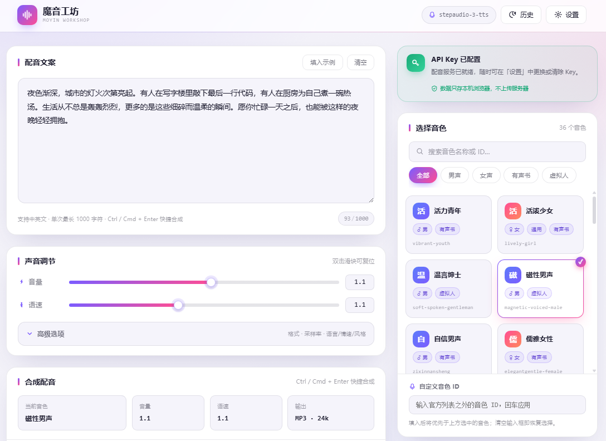
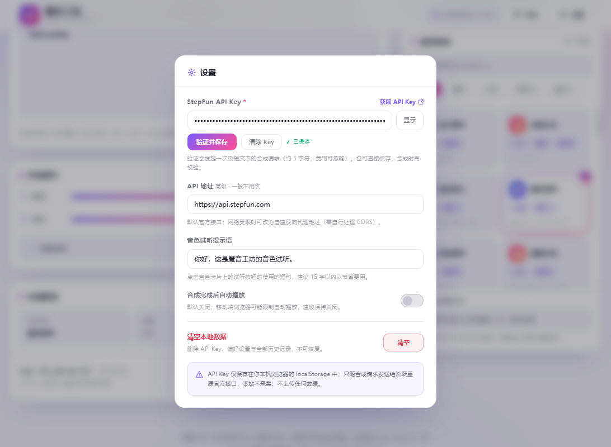

# 魔音工坊 · MoYin Workshop

> 纯静态、免后端、开箱即用的在线 AI 配音网站。
> 粘贴文案 → 选音色 → 调音量语速 → 一键合成 → 试听并下载。
> 底层调用阶跃星辰（StepFun）`stepaudio-3-tts` 模型的 `POST /v1/audio/speech` 接口。

**零依赖 · 零构建 · 可离线打开（仅合成请求需要联网）**



---

## 目录

- [功能一览](#功能一览)
- [快速开始](#快速开始)
- [本地运行](#本地运行)
- [部署](#部署)
- [文件结构](#文件结构)
- [技术要点](#技术要点)
- [localStorage 数据](#localstorage-数据)
- [常见问题](#常见问题)
- [安全说明](#安全说明)

---

## 功能一览

### 配音主流程

| 模块 | 说明 |
| --- | --- |
| 📝 文案输入 | 实时字数统计（上限 1000 字符）、超限红字禁用合成、粘贴超长自动截断、一键填入示例 / 清空 |
| 🎙 音色选择 | 内置 36 个官方音色（中文名 + ID + 性别 + 场景标签），支持按名称/ID 搜索与「全部 / 男声 / 女声 / 有声书 / 虚拟人」筛选；每个音色可单独试听；支持自定义音色 ID 作为兜底 |
| 🎚 声音调节 | 音量 0.1–2.0、语速 0.5–2.0 渐变滑块，双击滑块复位为 1.0 |
| ⚙ 高级选项 | 输出格式 mp3 / wav / flac / opus / pcm；采样率 8k–48k；语言 / 情绪 / 风格三选一音色标签（官方约束互斥，提交时只发送选中组） |
| 🎧 合成配音 | 卡片内含四个配置摘要格（当前音色 / 音量 / 语速 / 输出），随操作实时联动；状态行显示预计消耗字符与费用；`Ctrl / Cmd + Enter` 快捷合成 |
| ▶️ 试听播放 | 播放 / 暂停、可拖拽进度条、等宽时间显示、重播；播放中声波律动动画；PCM 格式会明确提示不支持在线试听 |
| ⬇ 下载 | 文件名 `魔音工坊-音色名-时间戳.ext`，扩展名随所选格式自动变化 |
| 🕘 历史记录 | 最近 20 条；音频以 base64 存本地（单条 ≤ 3MB，超出则仅存参数）；支持载入参数、回放、删除 |

### 引导与设置

| 模块 | 说明 |
| --- | --- |
| 💡 上手提示 | 右栏顶部常驻提示区：未配置 Key 时提示填写并提供「去设置」按钮（点击后自动聚焦输入框）；配置后自动降调为绿色确认态 |
| 🔐 设置 | API Key 密码框 / 明文切换 / 验证并保存 / 清除；输入框旁提供「获取 API Key ↗」直达官方页面；自定义 API 地址；音色试听提示语；合成后自动播放开关；一键清空本地数据（二次确认） |
| 🛡 错误提示 | 401 Key 无效 / 402 余额不足 / 429 限流 / 400 参数错误 / 451 内容风控 / 网络异常，全部中文化 Toast |
| 📱 响应式 | 桌面双栏布局，≤768px 自动切换单列堆叠，触控友好 |

所有数据（API Key、偏好设置、历史记录）**只存在你自己浏览器的 localStorage 里**，本站不采集、不上传任何数据；合成请求仅发往 `api.stepfun.com`（或你自行填写的 API 地址）。

设置弹窗：



---

## 快速开始

1. **获取 API Key**：打开 [platform.stepfun.com/interface-key](https://platform.stepfun.com/interface-key)（站内设置弹窗也提供该入口链接），创建并复制 Key。
2. **配置 Key**：打开网站，点右栏顶部提示区的 **「去设置」**（或右上角 **⚙ 设置**），粘贴 Key，点 **验证并保存**。
3. **开始配音**：粘贴文案（≤ 1000 字），挑选音色（可点卡片右下角试听），按需调整音量语速。
4. **合成与导出**：点 **🎧 合成配音**（或 `Ctrl / Cmd + Enter`），完成后在播放器试听、下载。

> 计费由阶跃星辰侧收取：2.5 元 / 万字符。音色试听同样会消耗少量字符费用，请按需使用。

---

## 本地运行

无需任何构建步骤，两种方式任选：

```bash
# 方式一：直接双击 index.html（file:// 协议可用）

# 方式二：起个本地静态服务（推荐，地址栏更干净）
python -m http.server 8080          # 然后访问 http://localhost:8080
# 或
npx serve .
```

---

## 部署

产出物为 4 个静态文件（`index.html` / `style.css` / `app.js` / `voices.js`），任何静态托管平台直接可用，**无需环境变量、无需服务端函数**：

| 平台 | 做法 |
| --- | --- |
| GitHub Pages | 仓库 Settings → Pages → 指向根目录（或 `main` 分支 `/root`） |
| Vercel | 拖拽目录到 vercel.com/new，或连仓库，零配置 |
| Netlify | app.netlify.com/drop 拖入目录即可 |
| Cloudflare Pages | 连仓库或直接上传，构建命令留空 |
| 国内 OSS + CDN | 上传 4 个文件并绑定域名 |

接口已实测支持 CORS（`Access-Control-Allow-Origin: *`），浏览器可直连，无需自建代理。部署后唯一的运行时依赖是用户自己的 StepFun API Key。

---

## 文件结构

```
moyin-workshop/
├── index.html        # 页面结构（语义化标签 + 内联 SVG 图标，无外部图片）
├── style.css         # 亮色主题 · 玻璃拟态卡片 · 紫品红渐变 · 响应式 ≤768px 单列
├── voices.js         # 36 个官方音色数据 + 标签分组（window.MOYIN_VOICES）
├── app.js            # 状态管理 / 合成 / 播放下载 / 历史 / 设置 / Toast / 错误处理
├── README.md         # 本文档
├── screenshots/      # 界面截图（README 配图）
└── docs/             # 需求文档与 API 分析文档
```

---

## 技术要点

### 为什么可以纯静态

阶跃星辰接口支持浏览器跨域直连，因此不需要任何后端或代理转发。音频以二进制流返回，前端用 `response.blob()` 接收后转 `URL.createObjectURL()`，既能直接喂给 `<audio>` 播放，也能通过 `<a download>` 保存文件——无需中转服务器，也不依赖接口的 `return_url` 方案。

### 请求参数组装

```js
{
  model: 'stepaudio-3-tts',      // 固定
  input: text,                   // ≤ 1000 字符
  voice: voiceId,                // 36 个官方 ID 或自定义 ID
  volume, speed,                 // 0.1–2.0 / 0.5–2.0
  response_format, sample_rate,
  text_normalization: 'standard',
  voice_label: { [type]: value } // 三选一，未指定时不发送该字段
}
```

`instruction` 参数仅 `stepaudio-2.5-tts` 支持，`stepaudio-3-tts` 传入会报错，本站一律不发送。

### 防重复与资源管理

- **全局单请求锁**：合成与音色试听互斥，避免并发请求互相干扰，后点者提示「请等待当前任务完成」。
- **ObjectURL 释放**：每次合成新音频前 `revokeObjectURL` 回收上一个 Blob URL，防止反复合成导致内存泄漏。
- **状态行结构化**：状态提示用两个固定子元素（默认态 / 自定义消息态）切换显隐，而非重建 DOM，避免元素 id 丢失。
- **按钮防挤压**：所有按钮设 `flex: none` + `white-space: nowrap`，避免在 flex 行内被同行文字压窄导致文字变形。

### 键盘快捷键

| 快捷键 | 功能 |
| --- | --- |
| `Ctrl / Cmd + Enter` | 合成配音 |
| `Esc` | 关闭设置弹窗 / 历史抽屉 |
| `←` `→`（播放器聚焦时） | 进度后退 / 前进 5 秒 |
| `Enter`（自定义音色输入框） | 应用自定义音色 ID |

---

## localStorage 数据

| Key | 内容 |
| --- | --- |
| `moyin.settings` | API Key、apiBase、音色与自定义音色、音量、语速、输出格式、采样率、voice_label、试听提示语、自动播放开关 |
| `moyin.history` | 最近 20 条合成记录（含 ≤3MB 的 base64 音频，超出则降级为仅存参数） |

刷新页面后音色、音量、语速、格式等偏好会自动恢复；文案与播放器状态属临时状态，不保留。

清空浏览器站点数据，或使用「设置 → 清空本地数据」即可彻底删除。

---

## 常见问题

**Q: 提示 API Key 无效？**
A: 到设置中检查 Key 是否复制完整（注意不要带入多余空格）；确认账户在 [platform.stepfun.com](https://platform.stepfun.com) 有可用余额。设置里的「验证并保存」会发一次极短英文文本的请求做校验。

**Q: 提示「内容被风控拦截」？**
A: 平台内容审查返回 451 `censorship_blocked`。实测该拦截具有间歇性，部分中文文案或网络环境会触发。按提示调整文案、稍后重试，或更换网络环境即可，与网站本身无关。

**Q: 选了「磁性男声」却像女声？**
A: 音色列表里有两个名称相近的条目——「磁性男声」(`magnetic-voiced-male`) 与「磁性女声」(`cixingnansheng`，官方原名同为「磁性男声」但实际是女声)，容易点错。另外若「自定义音色 ID」输入框里有值，它会**优先于**已选卡片生效（点卡片会自动清空该框）。

**Q: 点了播放没声音？**
A: PCM 为无容器原始音频流，浏览器无法直接播放，请下载后使用；个别浏览器对 flac / opus 支持有限，同样建议下载后播放。

**Q: 刷新后偏好还在吗？**
A: 在。音色、音量、语速、格式、采样率都会自动恢复；文案与播放器状态不保留。

**Q: 想换 API 地址？**
A: 设置 → API 地址，默认 `https://api.stepfun.com`，可改为自建反代（需自行处理 CORS）。

**Q: 历史记录的音频存不下？**
A: 单条音频超过 3MB 时会自动降级为只存参数不存音频（回放按钮将不可用），不影响主流程；若 localStorage 整体配额不足也会自动降级。

---

## 安全说明

- API Key 仅保存在本机浏览器 localStorage 中，**存储本身不加密**（明文/密文切换只是显示效果）——请勿在公用电脑上保存。
- 请求只发往 `api.stepfun.com`（或你自行填写的地址），本站零后端、零采集、零上报。
- 页面零外部依赖：无 CDN 字体、无图标库、无第三方脚本，断网也能打开页面，仅合成需要联网。
- 外链均带 `rel="noopener noreferrer"`，避免 `window.opener` 被利用。

---

## 相关文档

- [StepAudio 3 TTS API 分析文档](./docs/01-StepAudio3-TTS-API分析文档.md)
- [魔音工坊 网页需求与设计文档](./docs/02-魔音工坊-网页需求与设计文档.md)
